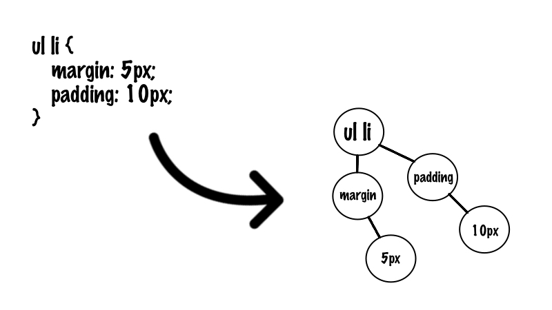
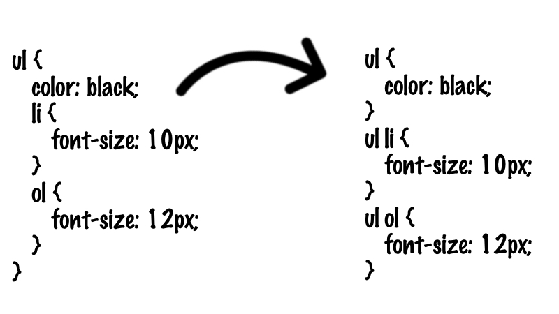

## sass编译过程和新特性

### sass编译过程

sass把.scss,.sass文件编译成.css文件本质还是编译原理，基本是以下三步

#### 语法解析器：生成抽象语法树（AST)



```css
$other-color: red;
$main_color: green;
@mixin border-radius {
  -webkit-border-radius: 10px;
     -moz-border-radius: 10px;
      -ms-border-radius: 10px;
          border-radius: 10px;
}
div {
  color: $main_color;
  @include border-radius;
}
p {
  color: blue;
  border-radius: 5px;
  border-color: $other-color;
}
```
默认使用utf-8的编码格式，解析器将解析文本，销毁注释，然后用符号‘ ; ’、‘{’、‘}’分割文本。 之后，我们将有一个字符串数组。

```css
[
	‘$other-color: red;’,
	’$main_color: green;‘,
	‘@mixin border-radius {’,
	  ’-webkit-border-radius: 10px;‘,
	     ‘-moz-border-radius: 10px;’,
	      ’-ms-border-radius: 10px;‘,
	          ‘border-radius: 10px;’,
	’}‘,
	‘div {’,
	  ‘color: $main_color;’,
	  ’@include border-radius;‘,
	’}‘,
	‘p {’,
	  ‘color: blue;’,
	  ‘border-radius: 5px;’,
	  ’border-color: $other-color;‘,
	’}‘,
]
```
遍历数组，通过标识符匹配判断，比如```$name,@mixin```这些进行判断，生成一个ast树

```js
[
  #<VarAssignAstNode 
    @class_name="VariableAssign.new", 
    @name="other-color", 
    @children=[], 
    @value= #<AstNodeValue @class_name="VirtualString.new", @value="red">>, 
  #<VarAssignAstNode 
    @class_name="VariableAssign.new", 
    @name="main_color", 
    @children=[], 
    @value= #<AstNodeValue @class_name="VirtualString.new", @value="green">>, 
  #<MixAssignAstNode 
    @class_name="MixinAssign.new", 
    @name="border-radius", 
    @children=[
      #<PropertyAstNode 
        @class_name="Property.new", 
        @name="-webkit-border-radius", 
        @children=[], 
        @value= #<AstNodeValue @class_name="VirtualString.new", @value="10px">>, 
      #<PropertyAstNode 
        @class_name="Property.new", 
        @name="-moz-border-radius", 
        @children=[], 
        @value= #<AstNodeValue @class_name="VirtualString.new", @value="10px">>, 
      #<PropertyAstNode 
        @class_name="Property.new",
        @name="-ms-border-radius", 
        @children=[], 
        @value= #<AstNodeValue @class_name="VirtualString.new", @value="10px">>, 
      #<PropertyAstNode 
        @class_name="Property.new", 
        @name="border-radius", 
        @children=[], 
        @value= #<AstNodeValue @class_name="VirtualString.new", @value="10px">>
    ], 
    @value= #<AstNodeValue @class_name="", @value="">>, 
  #<SelectorAstNode 
    @class_name="Selector.new", 
    @name="div", 
    @children=[
      #<PropertyAstNode 
        @class_name="Property.new", 
        @name="color", 
        @children=[], 
        @value= #<AstNodeValue @class_name="Variable.new", @value="main_color">>, 
      #<MixinAstNode 
        @class_name="Mixin.new",
        @name="border-radius", 
        @children=[], 
        @value= #<AstNodeValue @class_name="", @value="">>
    ], 
    @value= #<AstNodeValue @class_name="", @value="">>, 
  #<SelectorAstNode 
    @class_name="Selector.new", 
    @name="p", 
    @children=[
      #<PropertyAstNode 
        @class_name="Property.new", 
        @name="color", 
        @children=[], 
        @value= #<AstNodeValue @class_name="VirtualString.new", @value="blue">>, 
      #<PropertyAstNode 
        @class_name="Property.new", 
        @name="border-radius", 
        @children=[], 
        @value= #<AstNodeValue @class_name="VirtualString.new", @value="5px">>, 
      #<PropertyAstNode 
        @class_name="Property.new", 
        @name="border-color", 
        @children=[], 
        @value= #<AstNodeValue @class_name="Variable.new", @value="other-color">>
    ], 
    @value= #<AstNodeValue @class_name="", @value="">>
]
```


#### 转换器：将AST的嵌套转换成非嵌套



遍历一次AST，将含有children的嵌套节点转换为非嵌套节点。

```css

$other-color: red;
$main_color: green;
div {
  color: $main_color;
  p {
    color: $main_color;

    span {
      font-size: 9px;
    }
  }
}
p {
  color: blue;
}
```

```css
[
  #<VariableAssign 
    @name=:"other-color", 
    @expression= #<VirtualString @value="red">>, 
  #<VariableAssign 
    @name=:main_color, 
    @expression= #<VirtualString @value="green">>, 
  #<Selector 
    @name="div", 
    @declaration=[
      #<Property 
        @name="color", 
        @value= #<Variable @name=:main_color>>
    ]>, 
  #<Selector 
    @name="div p", 
    @declaration=[
      #<Property 
        @name="color", 
        @value= #<Variable @name=:main_color>>
    ]>, 
  #<Selector 
    @name="div p span", 
    @declaration=[
      #<Property 
        @name="font-size", 
        @value= #<VirtualString @value="9px">>
    ]>, 
  #<Selector 
    @name="p", 
    @declaration=[
      #<Property 
        @name="color", 
        @value= #<VirtualString @value="blue">>
    ]>
]
```
#### 编译器：将AST输出为css文件

遍历AST，把重复的去掉，然后利用buffer打印每个节点输出css文件


### 其他

- 关于@import
  -  @import未来会被废弃，改成@use
  -  @use仅会执行一次
  -  @use导入的文件可以访问另一个样式表的变量和mixin
  -  %name声明一个样式对象的被extend的时候才会渲染，类似于变量


  
  
  