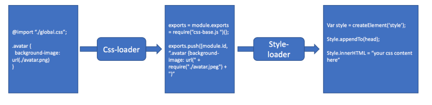

## sass编译过程和新特性

### sass编译过程

sass把.scss,.sass文件编译成.css文件本质还是编译原理，基本是以下三步

#### 语法解析器：生成抽象语法树（AST)


```css
$other-color: red;
$main_color: green;
@mixin border-radius {
  -webkit-border-radius: 10px;
     -moz-border-radius: 10px;
      -ms-border-radius: 10px;
          border-radius: 10px;
}
div {
  color: $main_color;
  @include border-radius;
}
p {
  color: blue;
  border-radius: 5px;
  border-color: $other-color;
}
```
默认使用utf-8的编码格式，解析器将解析文本，销毁注释，然后用符号‘ ; ’、‘{’、‘}’分割文本。 之后，我们将有一个字符串数组。

```css
[
	‘$other-color: red;’,
	’$main_color: green;‘,
	‘@mixin border-radius {’,
	  ’-webkit-border-radius: 10px;‘,
	     ‘-moz-border-radius: 10px;’,
	      ’-ms-border-radius: 10px;‘,
	          ‘border-radius: 10px;’,
	’}‘,
	‘div {’,
	  ‘color: $main_color;’,
	  ’@include border-radius;‘,
	’}‘,
	‘p {’,
	  ‘color: blue;’,
	  ‘border-radius: 5px;’,
	  ’border-color: $other-color;‘,
	’}‘,
]
```
遍历数组，通过标识符匹配判断，比如```$name,@mixin```这些进行判断，生成一个ast树

```js
[
  #<VarAssignAstNode 
    @class_name="VariableAssign.new", 
    @name="other-color", 
    @children=[], 
    @value= #<AstNodeValue @class_name="VirtualString.new", @value="red">>, 
  #<VarAssignAstNode 
    @class_name="VariableAssign.new", 
    @name="main_color", 
    @children=[], 
    @value= #<AstNodeValue @class_name="VirtualString.new", @value="green">>, 
  #<MixAssignAstNode 
    @class_name="MixinAssign.new", 
    @name="border-radius", 
    @children=[
      #<PropertyAstNode 
        @class_name="Property.new", 
        @name="-webkit-border-radius", 
        @children=[], 
        @value= #<AstNodeValue @class_name="VirtualString.new", @value="10px">>, 
      #<PropertyAstNode 
        @class_name="Property.new", 
        @name="-moz-border-radius", 
        @children=[], 
        @value= #<AstNodeValue @class_name="VirtualString.new", @value="10px">>, 
      #<PropertyAstNode 
        @class_name="Property.new",
        @name="-ms-border-radius", 
        @children=[], 
        @value= #<AstNodeValue @class_name="VirtualString.new", @value="10px">>, 
      #<PropertyAstNode 
        @class_name="Property.new", 
        @name="border-radius", 
        @children=[], 
        @value= #<AstNodeValue @class_name="VirtualString.new", @value="10px">>
    ], 
    @value= #<AstNodeValue @class_name="", @value="">>, 
  #<SelectorAstNode 
    @class_name="Selector.new", 
    @name="div", 
    @children=[
      #<PropertyAstNode 
        @class_name="Property.new", 
        @name="color", 
        @children=[], 
        @value= #<AstNodeValue @class_name="Variable.new", @value="main_color">>, 
      #<MixinAstNode 
        @class_name="Mixin.new",
        @name="border-radius", 
        @children=[], 
        @value= #<AstNodeValue @class_name="", @value="">>
    ], 
    @value= #<AstNodeValue @class_name="", @value="">>, 
  #<SelectorAstNode 
    @class_name="Selector.new", 
    @name="p", 
    @children=[
      #<PropertyAstNode 
        @class_name="Property.new", 
        @name="color", 
        @children=[], 
        @value= #<AstNodeValue @class_name="VirtualString.new", @value="blue">>, 
      #<PropertyAstNode 
        @class_name="Property.new", 
        @name="border-radius", 
        @children=[], 
        @value= #<AstNodeValue @class_name="VirtualString.new", @value="5px">>, 
      #<PropertyAstNode 
        @class_name="Property.new", 
        @name="border-color", 
        @children=[], 
        @value= #<AstNodeValue @class_name="Variable.new", @value="other-color">>
    ], 
    @value= #<AstNodeValue @class_name="", @value="">>
]
```


#### 转换器：将AST的嵌套转换成非嵌套


遍历一次AST，将含有children的嵌套节点转换为非嵌套节点。

```css

$other-color: red;
$main_color: green;
div {
  color: $main_color;
  p {
    color: $main_color;

    span {
      font-size: 9px;
    }
  }
}
p {
  color: blue;
}
```

```css
[
  #<VariableAssign 
    @name=:"other-color", 
    @expression= #<VirtualString @value="red">>, 
  #<VariableAssign 
    @name=:main_color, 
    @expression= #<VirtualString @value="green">>, 
  #<Selector 
    @name="div", 
    @declaration=[
      #<Property 
        @name="color", 
        @value= #<Variable @name=:main_color>>
    ]>, 
  #<Selector 
    @name="div p", 
    @declaration=[
      #<Property 
        @name="color", 
        @value= #<Variable @name=:main_color>>
    ]>, 
  #<Selector 
    @name="div p span", 
    @declaration=[
      #<Property 
        @name="font-size", 
        @value= #<VirtualString @value="9px">>
    ]>, 
  #<Selector 
    @name="p", 
    @declaration=[
      #<Property 
        @name="color", 
        @value= #<VirtualString @value="blue">>
    ]>
]
```
#### 编译器：将AST输出为css文件

遍历AST，把重复的去掉，然后利用buffer打印每个节点输出css文件


### sass-loader,css-loader处理

```js
const scssRules = [
    {
      loader: 'css-loader',
      options: {
        modules: {
          localIdentName: config.cssScopeName,
          context: process.cwd(),
        },
        importLoaders: 3,
        sourceMap: false,
      },
    },
    {
      loader: 'postcss-loader',
      options: {
        plugins: () => {
          const plugin = [autoprefixer()];
          if (config.pxtorem) {
            plugin.push(pxtorem(config.pxtorem));
          }
          return plugin;
        },
      },
    },
    'sass-loader',
  ];
   if (!config.isDev && config.extraCssPlugin) {
    scssRules.unshift({ loader: MiniCssExtractPlugin.loader });
  } else {
    scssRules.unshift('style-loader');
  }
```

通过 sass-loader 把 SCSS 源码转换为 CSS 代码，再把 CSS 代码交给 css-loader 去处理。
css-loader 会找出 CSS 代码中的 @import 和 url() 这样的导入语句，告诉 Webpack 依赖这些资源。同时还支持 CSS Modules、压缩 CSS 等功能。处理完后再把结果交给 style-loader 去处理。



```css
// style.css
@import './global.css';
h1 {
  color: #f00;
}
.avatar {
  width: 100px;
  height: 100px;
  background-image: url('./avatar.jpeg');
  background-size: cover;
}
```
```
// global.css
body {
  background-color: #f1f1f1;
}
```
- 把 @import 替换成 require(“-!../node_modules/css-loader/index.js!./global.css”)， -! 语法会禁用掉 preLoader 和 loader，因此这一个require并不会递归调用自己。
- 把 background-image: url(‘./avatar.jpeg’) 替换成 “background-image: url(” + require(“./avatar.jpeg”) + “)”

css-loader源码解析

- processCss.js 中会调用 postcss 对 css 源码进行解析，然后遍历其中的 declaration 并抽离出 url 和 import 这两种依赖
- loader.js 会调用 processCss，根据它已经分析出的 url 和 import 依赖关系，在对应的代码中替换成 require，并拼接成段最终的JS返回

实现一个简单的css-loader（处理 import 和 url 两种依赖）

```
var parserPlugin = postcss.plugin("css-loader-parser", function(options) {
    return function(css) {
        var importItems = []; // 存储 import 依赖
        var urlItems = []; // 存储 url 依赖
    // 遍历所有的 import 规则，然后存储到 importItems 中
    css.walkAtRules(/^import$/i, function(rule) {
      var values = Tokenizer.parseValues(rule.params);
      var url = values.nodes[0].nodes[0];
      if(url && url.type === "url") {
        url = url.url;
      } else if(url && url.type === "string") {
        url = url.value;
      }
      importItems.push({
        url: url
      });
    });
function processNode(item) {
    switch (item.type) {
        case "value":
            item.nodes.forEach(processNode);
            break;
        case "nested-item":
            item.nodes.forEach(processNode);
            break;
        case "url":
  // 如果是一个url依赖，那么需要：
  // 1. 把它替换成一个占位符
  // 2. 把它对应的url存在 urlItems 中
  // 这样下一步我们就可以从 urlItems 中取出url 替换掉占位符
            if (loaderUtils.isUrlRequest(item.url)) {
                var url = item.url;
                item.url = "___CSS_LOADER_URL___" + urlItems.length + "___";
                urlItems.push({
                    url: url
                });
            }
            break;
    }
}
var icss = icssUtils.extractICSS(css);
exports = icss.icssExports; // 这就是css名字被编译后的映射表
    css.walkDecls(function(decl) {
        var values = Tokenizer.parseValues(decl.value);
        values.nodes.forEach(function(value) {
            value.nodes.forEach(processNode);
        });
        decl.value = Tokenizer.stringifyValues(values);
    });
    options.importItems = importItems;
    options.urlItems = urlItems;
    options.exports = exports;
};
})

module.exports = function (inputSource) {
  if(this.cacheable) this.cacheable()
  var callback = this.async()
  var options = {
    mode: 'local'
  }
  var pipeline = postcss([
    localByDefault({mode: options.mode}), // localByDefault 会把所有的 class 都编译成 :local(class) 形式
    modulesScope(), // modulesScope 会把 :local(class) 编译成 一个hash的类名，和上面的结合起来就可以实现 css modules
    parserPlugin(options)
  ])
  pipeline.process(inputSource).then(function (result) {
    // 处理import
        var alreadyImported = {};
        // 这里开始处理 importItems 中记录的依赖，比如 对 `global.css` 的依赖
        var importJs = options.importItems.filter(function(imp) {
            // 因为很可能同一个模块会被多次依赖，所以要去重一下。
      if(alreadyImported[imp.url]) return false;
      alreadyImported[imp.url] = true;
            return true;
        }).map(function(imp) {
      // 对于新的依赖，就在这里处理, 加载远程资源的这里我们就不处理了。直接把所有的 import 都替换成 require
      return "exports.i(require(" + loaderUtils.stringifyRequest(this, imp.url) + "))";
        }, this);

    // 省略 sourcemap
    var cssAsString = JSON.stringify(result.css)

    // 处理 url
    var URLREG_G =  /___CSS_LOADER_URL___(\d+)___/g
    var URLREG =  /___CSS_LOADER_URL___(\d+)___/
    // 正则式匹配所有的占位符，然后取出其中的id，根据id在 urlItems 中找到对应的url，然后替换即可。
    cssAsString = cssAsString.replace(URLREG_G, function(item) {
      var match = URLREG.exec(item)
      if (!match) return item;
      const url = options.urlItems[+match[1]].url

      return '" + require("' + url + '") + "';
    })
   
    var moduleJs = "exports.push([module.id, " + cssAsString + ", ""]);";

    // 我们的最终结果 包括这几部分:
    // 1. 引入 css-base，这个模块定义了 exports 默认的行为，包括 toString 和 i
    // 2. 所有的 import 依赖
    // 3. 导出自身
    // 4. locals
    callback(null, [
      'exports = module.exports = require(' +
      loaderUtils.stringifyRequest(this, require.resolve("./css-base.js")) +
      ")();\n",
      importJs.join(''),
      moduleJs,
      'exports.locals =' + JSON.stringify(options.exports)
    ].join(';'))
  })
}
```

### 其他

- 关于@import
  -  @import未来会被废弃，改成@use
  -  @use仅会执行一次
  -  @use导入的文件可以访问另一个样式表的变量和mixin
  -  %name声明一个样式对象的被extend的时候才会渲染，类似于变量


  
  
  